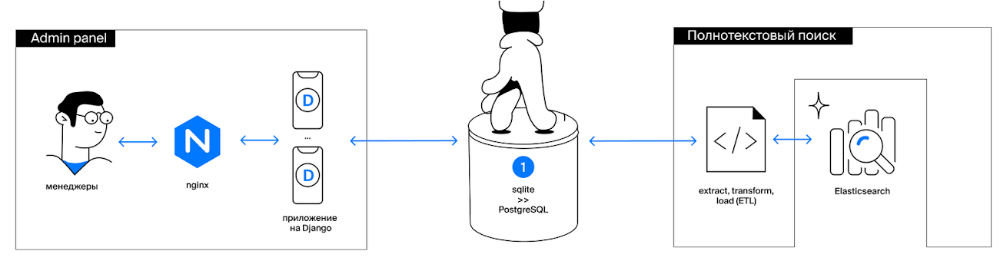

# Описание структуры 

2. `django_api` — реализация API для выдачи информации о фильме.
1. `etl` — реализация Extract Transform Load процесса из PostgreSQL в Elasticsearch

## Первичный запуск
- необходимо перейти в директорию с `docker-compose.yml`
> - cd etl/simple_project
- запустить докеры
> - docker compose up -d --build

### Как это работает?

## первичная миграция данных из SqLite в PostgreSQL
> - сама база данных в `etl\simple_project\app\sqlite_to_postgres\db.sqlite`
> - точка входа `etl\simple_project\app\sqlite_to_postgres\load_data.py`

Подключаясь к SqLite и PostgreSQL скачиваем пачками информацию из SqLite и также пачками грузим ее в PostgreSQL
## Админка
> точка входа http://localhost/admin
>> логин `admin` и пароль `admin`

Админка, позволяющая работать с базой через Django Admin
В случае добавления новой записи в базу - процесс ETL должен синхронизовать изменения

## Полнотекстовый поиск
>точка входа - файл load_data.py

Процесс ETL (Extract-Transform-Load процесс перекачки данных) из PostgreSQL в Elasticsearch работает следующим способом:
    
    в бесконечном цикле: 
    - обращаемся к хранилищу состояния (в данной реализации это Json file, в котором сохранено last_sync_timestamp - метка последней синхронизации и filmwork_ids - список)
    - смотрим в PostgreSQL классом Extract
    - если что-то нашли - передаем в класс Transform
    - и грузим в ElasticSearch классом Load
    - паралельно фиксируем это все в хранилище состояния для того, чтобы в случае падения сервиса не начинать все заново, а продолжать с последнего зафиксированного состояния.
    - ждем какое-то время и по новой 
